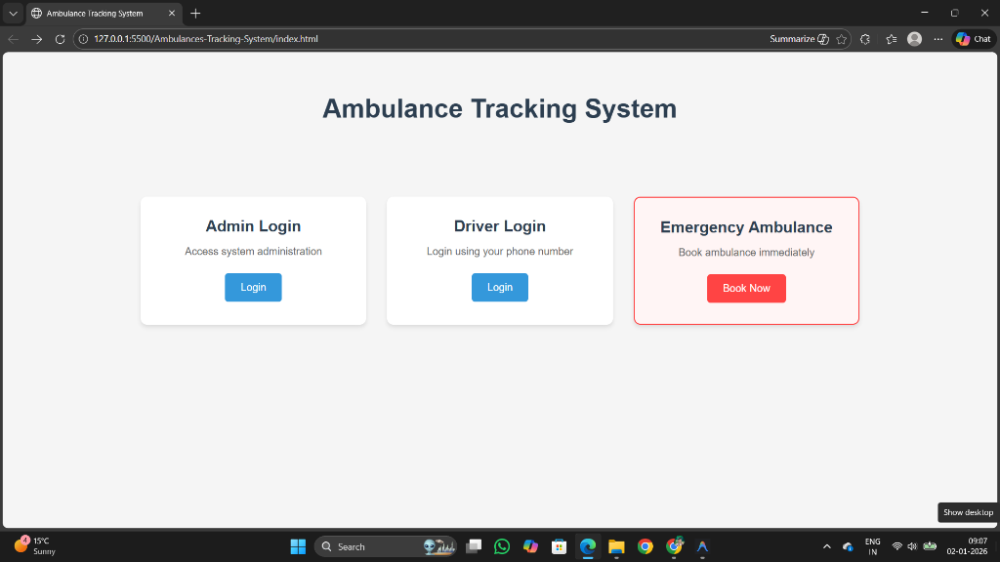
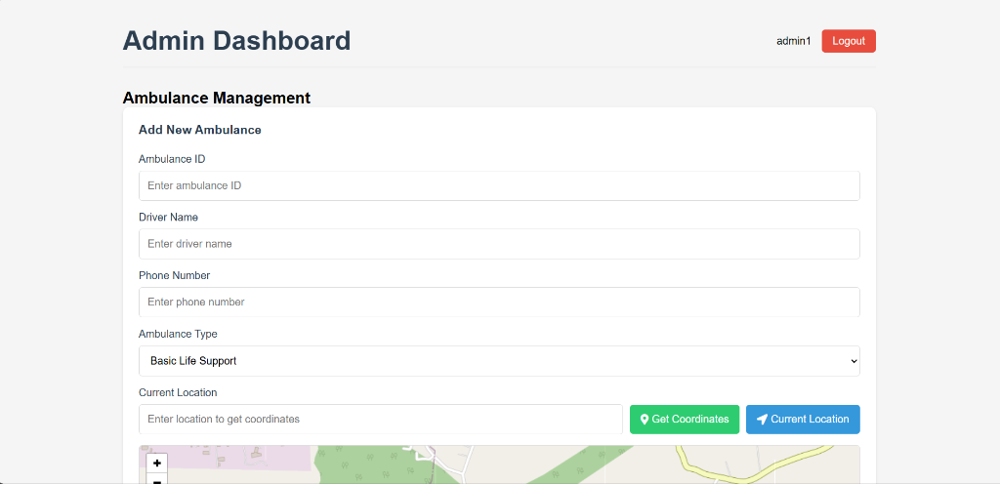
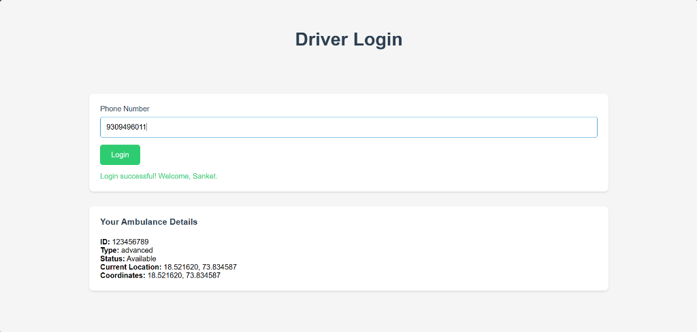
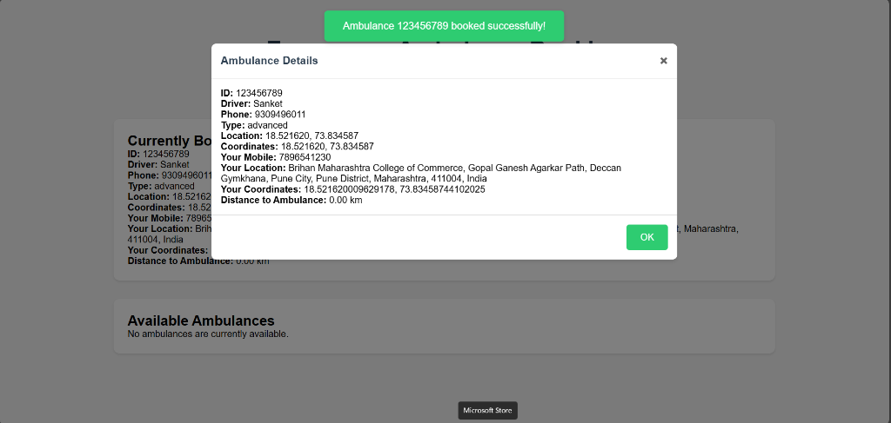
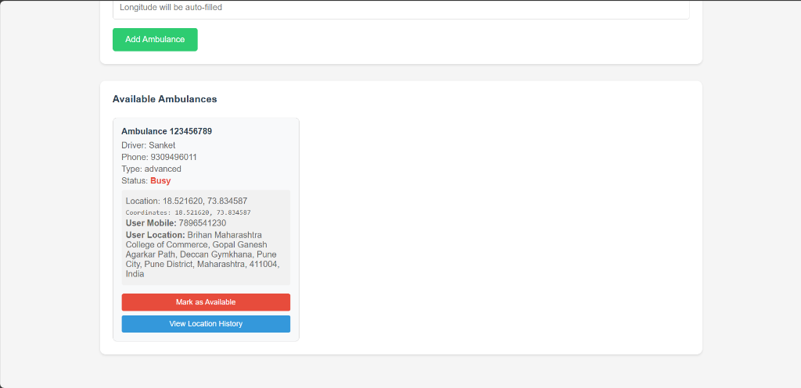

# Ambulance Tracking System

A comprehensive web-based solution for real-time ambulance tracking, emergency booking, and fleet management.

## 🚀 Features

- **Emergency Booking:** Instant ambulance request for users in need.
- **Admin Dashboard:** Manage ambulances, drivers, and track fleet status.
- **Driver Interface:** Real-time status updates and location synchronization.
- **Modern UI:** Clean, responsive, and user-friendly interface.

## 📸 Screenshots

### Main Landing Page


### Admin Dashboard


### Driver Login & Status


### Emergency Booking Confirmation


### Live Ambulance Status


## 🛠️ Tech Stack

- **Frontend:** HTML5, CSS3, JavaScript
- **Backend Logic:** JavaScript (Client-side simulation)
- **Styling:** Custom CSS with modern design principles

## 🏗️ Installation

1. Clone the repository:
   ```bash
   git clone https://github.com/sanketdevkar/Ambulances-Tracking-System.git
   ```
2. Open `index.html` in your browser.

---
Developed by [Sanket Devkar](https://www.linkedin.com/in/sanketdevkar/)
